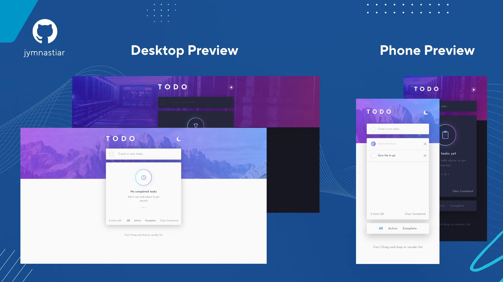

# Frontend Mentor - Todo app solution

This is a solution to the [Todo app challenge on Frontend Mentor](https://www.frontendmentor.io/challenges/todo-app-Su1_KokOW). Frontend Mentor challenges help you improve your coding skills by building realistic projects.

## Table of contents

- [Overview](#overview)
  - [The challenge](#the-challenge)
  - [Screenshot](#screenshot)
  - [Links](#links)
- [My process](#my-process)
  - [Built with](#built-with)
  - [What I learned](#what-i-learned)
  - [Continued development](#continued-development)
  - [Useful resources](#useful-resources)
- [Author](#author)

## Overview

### The challenge

Users should be able to:

- View the optimal layout for the app depending on their device's screen size
- See hover states for all interactive elements on the page
- Add new todos to the list
- Mark todos as complete
- Delete todos from the list
- Filter by all/active/complete todos
- Clear all completed todos
- Toggle light and dark mode

### Screenshot



### Links

- [Solution URL](https://github.com/jymnastiar/todo-vite-app)
- [Live Site URL](https://todo-vite-app-jym.vercel.app)

## My process

### Built with

- JavaScript (ES6+) – Main programming language
- [React](https://reactjs.org/) – JS library for building UI
- [Vite](https://vitejs.dev/) – Dev server & build tool
- [Tailwind CSS](https://tailwindcss.com/) – Utility-first styling
- [UUID](https://www.npmjs.com/package/uuid) – Unique ID generator for todo items
- LocalStorage API – Browser storage for persisting todos

### What I learned

Working on this Todo App helped me strengthen several key skills in frontend development:

- **React component architecture** – I practiced breaking down the app into reusable components like `Header`, `Form`, `Item`, and `Container`.
- **State management with Hooks** – I used `useState` and `useEffect` for handling todos, filtering, and theme toggling.
- **Persistent storage** – Learned how to persist todos using the `localStorage` API.
- **Dynamic class handling with Tailwind CSS** – I implemented dark/light mode and conditional styling for completed tasks.
- **Generating unique IDs** – Used the `uuid` library to ensure each todo item has a unique identifier.

Here are some code snippets I’m proud of:

**React state & localStorage integration**

```js
const [items, setItems] = useState(() => {
  const saved = localStorage.getItem("todos");
  return saved ? JSON.parse(saved) : [];
});

useEffect(() => {
  localStorage.setItem("todos", JSON.stringify(items));
}, [items]);
```

### Continued development

In the future, I want to continue improving this project and my React skills. Specifically, I plan to:

- Deepen my understanding of **React state management** by experimenting with more complex states and nested data structures.
- Explore **advanced React Hooks** such as `useReducer`, `useContext`, and custom hooks to make state logic more reusable and maintainable.
- Implement **performance optimizations** using `useMemo` and `useCallback` to reduce unnecessary re-renders.
- Learn **React testing** with tools like Jest and React Testing Library to write robust, testable components.
- Expand the app features with **drag-and-drop reordering**, **user authentication**, and **persistent backend storage** using Firebase or Node.js.

### Useful resources

Here are some of the key resources that helped me understand React basics and improve my skills:

- [React](https://reactjs.org/docs/getting-started.html) – The official React docs are great for learning concepts, hooks, and component patterns.
- [Next.js](https://nextjs.org/docs) – While this project uses Vite, the Next.js docs helped me understand React page-based routing and component structure.
- [YouTube (WPU)](https://www.youtube.com/watch?v=kcnwI_5nKyA&list=PLFIM0718LjIUu3X2zYNqomEWs3sYd-fV1) – This playlist taught me React fundamentals, state, props, and component structure.

## Author

- Frontend Mentor - [@jymnastiar](https://www.frontendmentor.io/profile/jymnastiar)
- Linkedin - [@jymnastiar](https://www.linkedin.com/in/jymnastiar/)
